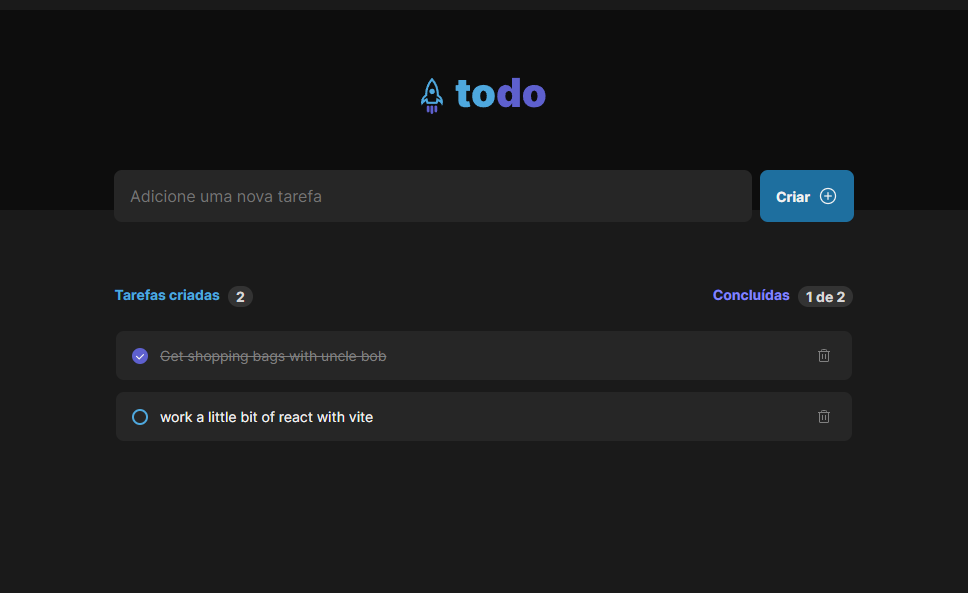

# React Todo Manager

#### -> [Vercel live Demo](https://ignite-todo-ten.vercel.app/) <-


Challenge from rocketseat ignite course. The student must create application from scratch using layout guides provided from rocketseat staff.

## Setting up develop environment

```
pnpm install
```

Run server on <b>port 5173</b> by default, or next port available

```
pnpm run dev
```

Open your browser on designed port and boom:

## Project running



This template provides a minimal setup to get React working in Vite with HMR and some ESLint rules.

All rights reserved to [Rocketseat](https://www.rocketseat.com.br/)
